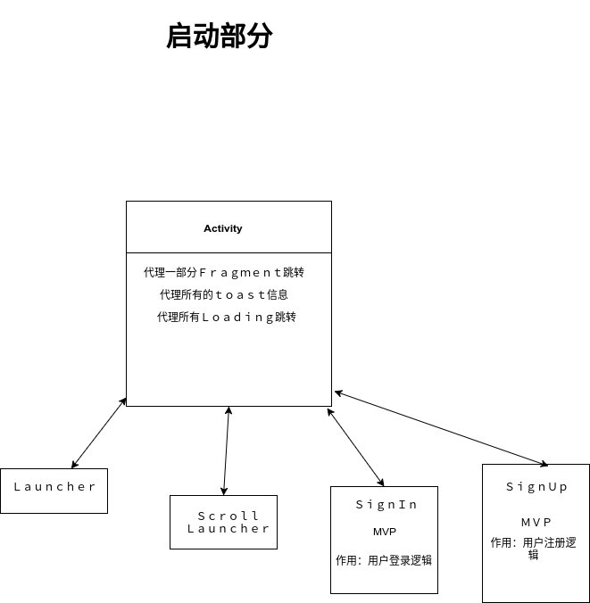
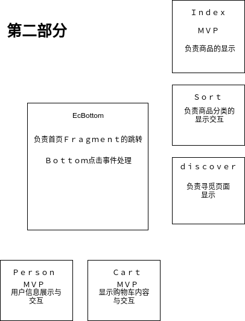
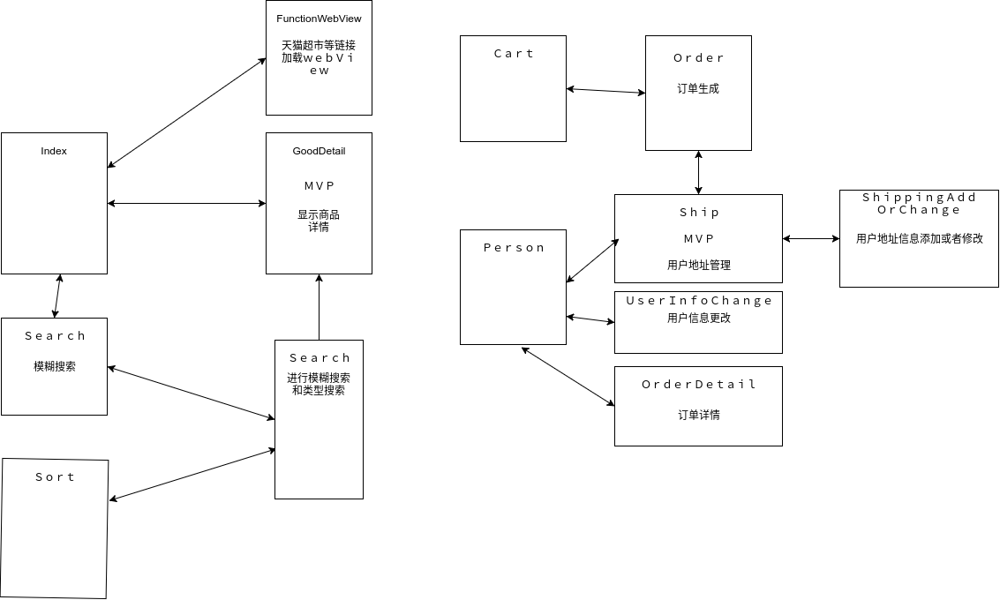

[README English Version](https://github.com/pcdack/oscsMall/blob/master/README_EN.md)
# 一个Ａｌｍｏｓｔ完整的电商项目后台＋安卓客户端

一转眼就已经大三了，作为非ＣＳ专业的一个普通大学生，应该对自己的未来做规划了。于是，大三开始我就开始着手准备一个“大项目”。将前两年学习的知识做一个总结，归纳。于是就有了这个项目。项目的名字叫OscsMall,为什么叫这个名字我也不知道。至于Ａｌｍｏｓｔ是因为整个项目缺少了支付部分的代码，原因是拿不到微信的ｋｅｙ。整个项目分为后端和客户端，后端代码显得稚嫩，客户端代码也算拿的的出手。还恳请个位大佬轻喷。项目自然参考了其他大神的代码。这个项目我也会一直维护下去的，恳请大佬们ｓｔａｒ一下。

[项目效果展示](http://www.jianshu.com/p/5d8f6a018c3d)

## 后台

后台其实没什么好介绍的，整个项目使用Ｓｐｒｉｎｇ＋ＭｙＢａｔｉｓ＋ＭｙＳＱＬ，项目采用ＭＶＣ模式。包含前台和后台管理部分代码。是一个很普通的电商项目，包含了８大结构，６大模块。

### 项目结构

#### ｃｏｍｍｏｎ

作用：用来处理公共的信息，包括Ｔｏｋｅｎ，常量，全局异常，公共类等封装

#### ｃｏｎｔｒｏｌｌｅｒ

作用：包括前台和后台部分的`controller`代码

#### service

作用：项目中要到的`service`部分

### dao

作用：负责`ｄａｏ`层

#### pojo

作用：数据库对象

#### vo

作用：`ｖｉｅｗ　ｏｂｊｅｃｔ`前端对象

#### util

作用：一些简单的工具类

### 项目模块(详情见文档)

#### 用户信息

包括：用户登录，注册，信息获取，注销等流程，管理登录

#### 商品信息

商品增加删除更新，同时放置非管理员对商品的属性进行操作

#### 商品分类信息

商品分类信息，包括子分类的信息获取

#### 购物车

购物车添加，删除，选择，更新等管理

#### 订单

订单生成，不同类型的订单查询等管理

#### 地址

地址增加，删除，选择等功能

> 具体的内容在wiki里

##　客户端

# 更新Login界面

很多人吐槽很丑所以我会一步一步的慢慢将界面逐渐美化

**展示页面Ｂａｔｅ**

> 注意：这个界面并没有直接接到当前项目中，只是一个测试版（有很多bug,需要慢慢修复），如果要在OscsMall中使用这个界面，需要在MainActivity中指定。

展示

* 分类

* 寻觅(混合开发，图中展示了js与java互相调用的场景)

* 购物车(购物车每次点击都以为着网络请求，所以这里的请求是相对比较密集的)

* 个人中心（我的,其中空白的是由于我直接更改数据库造成的）

#### 客户端的整体架构

整体采用了单Ａｃｔｉｖｉｔｙ多ｆｒａｇｍｅｎｔ的设计思路

#####  网络模块（两种）

1.  使用rxJava与retrofit2和okhttp3组成网络请求框架(有些时候Ｒｘｊａｖａ并不能按照预期给出结果，让我有点苦恼。水平不够，嘤嘤嘤)

2. 未使用rxJava的网络框架，整个请求写法上类似于Velloy

##### Ａｐｐ配置相关

* 整个Ａｐｐ的图标全部使用ｉｃｏｎ
* 使用Ｂｕｉｌｄｅｒ设计模式来配置整个应用信息(使用什么ｉｃｏｎ，内置了ｉｃｏｎｉｆｙ中给出的所有Ｉｃｏｎ)

##### 代理Ａｃｔｉｖｉｔｙ

作为整个程序唯一一个Ａｃｔｉｖｉｔｙ，作为所有Ｆｒａｇｍｅｎｔ的代理

##### ＭＶＰ相关

作为ＭＶＰ模式的基类

##### UI相关

ＵＩ处理部分

#### Ａｐｐ的整体流程

##### App的整体流程分为三部分

##### 第一部分

**流程**：首页展示前，整个Ａｃｔｉｖｉｔｙ作为Ｆｒａｇｍｅｎｔ的调度站，负责Ｆｒａｇｍｅｎｔ的跳转和信息传递。这样的好处是，避免跳转流程复杂，导致自己开发时候很晕。一般Ｆｒａｇｍｅｎｔ的跳转需要Ａｐｐ的当前状态，用户的当前状态，通过这两状态去决定下一个Ｆｒａｇｍｅｎｔ是什么。

同时整个Ａｃｔｉｖｉｔｙ代理了所有的ｔｏａｓｔ信息的展示，和Ｌｏａｄｉｎｇ加载。这样整个流程更加清晰。

##### 第二部分

首页展示后，整个Ｂｏｔｔｏｍ　Ｆｒａｇｍｅｎｔ作为调度站，负责在各个页面之间进行跳转。

##### 第三部分

不同首页需要其他额外的Ｆｒａｇｍｅｎｔ，由该Ｆｒａｇｍｅｎｔ自己掌控。

##### 目的：

Ａｐｐ整体流程是我自己的一些小技巧的总结，让同级的`Ｆｒａｇｍｅｎｔ`之间的调用更加清楚，这样设计,如果Ａｐｐ加入新的类型的启动页，我们就不用更改相关所有`Ｆｒａｇｍｅｎｔ`的代码，而只需要更改`Ａｃｔｉｖｉｔｙ`的代码就可以了。

##### 总结

整个Ａｐｐ被分成４层，第一层是`Ａｃｔｉｖｉｔｙ`，把握了第二层的`Ｆｒａｇｍｅｎｔ`的调用顺序，第二层`Ｆｒａｇｍｅｎｔ`把握了第三层的调用，以此类推。

##### 

