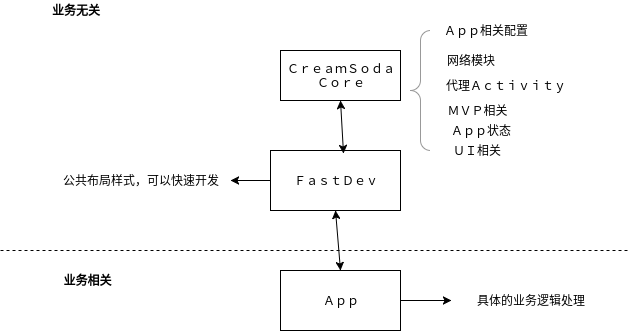

# A almost complete E-commerce project server && android client

> I am not an English native speaker.If i say  something strange ,please forgive me.thx

This is my first “formal”　project.I am not a computer science student in college.So if the project is not great ,please forgive me.If you think the project is fun,please give me a star.

## back-end

The entire project uses Spring+MyBaits+MySQL,The project uses MVC model.This project includes front and  management.

## Project structure

### common

**function**:Used to handle public information, including Token, constants, global exceptions, public class encapsulation.

### controller

**function**:including the foreground and background part of the controller code

### service

**function**:The service part to the project

### dao

### pojo

### vo

**function**:front-end object

### util

**function**:simple tools

## Project module (see documentation for details)

### user information

**include**: user login,register,get user infomation,exit and more.

### product information

**include**:product add,delete,update

### category management

Product classification information, including sub-category information acquisition

### cart

Shopping Cart Add, delete, select, update and other management

### order

Order generation, different types of order inquiry and other management

### shipping

Add, delete, select and other functions

> more detail in wiki

# Android Client

Many people think my UI is ugly so I will step by step gradually  beautify the interface.

## update the login interface

**the new Index **

> the new Index may be have many bugs.So if you want to use it.You need to change the root fragment in MainAcitivity to *NewIndexDelegate* Thx.The stable version will submit in next commit.

the show

## Categroy

## discovery (Hybrid development, the picture shows the js and java call each other scenes)

* cart

* personal

## Overall structure

The overall use of single Activity multi-fragment design ideas

### Network module (two kinds)

* Using rxJava with retrofit2 and okhttp3 make up the web request framework (sometimes Rxjava does not deliver the results as expected, which gives me a little bit of distress.)
* The rxJava network framework is not used, the entire request wording similar to Velloy.

### App related configuration

* The entire app icon all used vector illustration
* Use Builder design patterns to configure the entire application information

### Agent Activity

As the only one Activity in application, as all Fragment's agent.

### MVP related

As a base class for MVP patterns

### UI related

UI processing section

